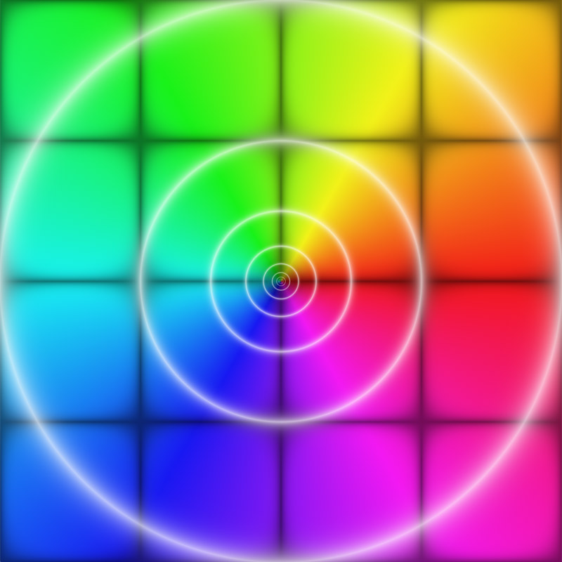
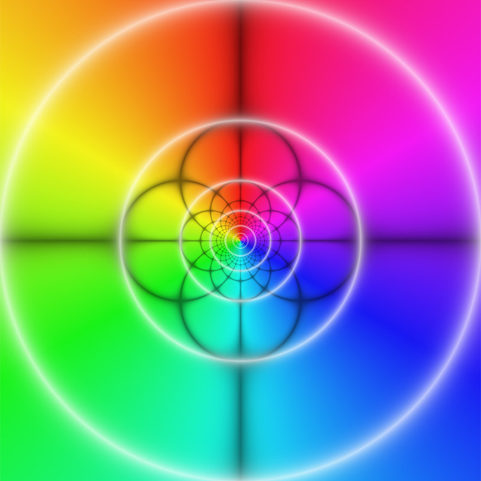

# glsl-domain-coloring

> [Domain coloring](https://en.wikipedia.org/wiki/Domain_coloring) as a shader, via [glslify](http://github.com/chrisdickinson/glslify).

[](https://nodei.co/npm/glsl-domain-coloring)

## Introduction

[Domain coloring](https://en.wikipedia.org/wiki/Domain_coloring) is an improvement over simple coloring by the complex argument and lightness by the magnitude. It makes the function easier to understand by applying the following logic:

- the complex argument determines the hue. (Red is positive real and cyan is negative real, while green-yellow is positive imaginary and blue-magenta is negative imaginary.)
- contours of the complex magnitude are lightened. The contours occur near integer values of `log2(|z|)`.
- real and imaginary grid lines are darkened. With grid spacing (1, 1), this means that the dark lines are simply the unit grid.

The result of these choices is that the behavior of the function is easier to discern than by a simple colormap. For example, the function `f(z) = z` plotted from -2 to 2 on the real and imaginary axes results in the colormap:

<p align="center">
  <a href="http://rreusser.github.io/glsl-domain-coloring/z.html"></a>
</p>

The function `f(z) = 1 / z` in the same range results in the map:

<p align="center">
  <a href="http://rreusser.github.io/glsl-domain-coloring/recip.html"></a>
</p>

In the second example, the behavior as a pole of the function is visible by the bunching up of the grid lines as the magnitude contours get closer and closer. In the first example, the bunching up of the magnitude contours without bunching up of the grid lines means it is a zero.

## Examples

Live demos:

- [`f(z) = z`](http://rreusser.github.io/glsl-domain-coloring/z.html)
- [`f(z) = 1 / z`](http://rreusser.github.io/glsl-domain-coloring/recip.html)
- [`f(z) = cos(z) / sin(z^4 - 1)`](http://rreusser.github.io/glsl-domain-coloring/eqn.html)

To use with glslify:

``` glsl
#pragma glslify: domainColoring = require(glsl-domain-coloring)

attribute vec3 position;

varying vec2 z;

void main () {
  gl_FragColor = domainColoring(z, vec2(1.0), 0.9, 0.5, 0.7);
}
```

## API

#### `vec3 domainColoring(vec2 f, vec2 gridSpacing, float saturation, float gridStrength, float magStrength)`

Returns the rgb value given the real and imaginary components of f.

Arguments: 

- `f`: A `vec2` containing the real and imaginary components of the function
- `gridSpacing`: a `vec2` containing the spacing of the grid in the x and y directions
- `saturation`: the saturation of the coloring, from zero to one
- `gridStrength`: the strength of the rectangular grid, from zero to one
- `magStrength`: the strength of the magnitude contours, from zero to one

## License

&copy; 2016 Ricky Reusser. MIT License.
